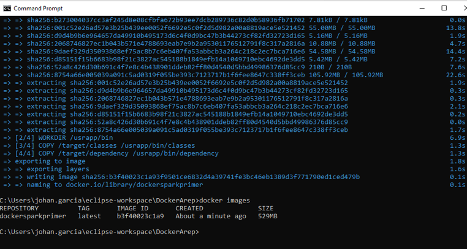
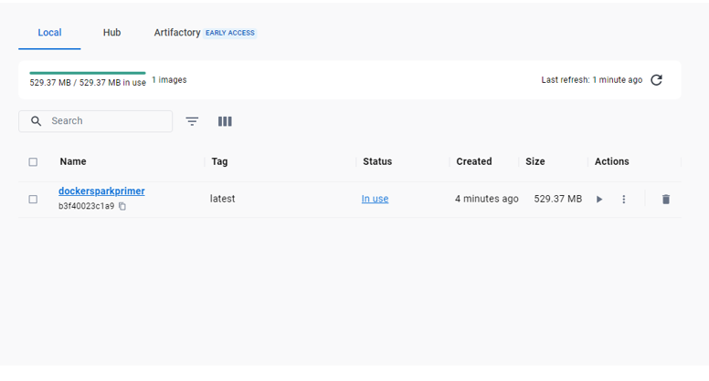

<em> # Docker Virtualization</em>

---

## Johan Sebastian Garcia Martinez

---

### Requerimientos para la implementación del laboratorio completo

- Maven
- Java
- Spark
- Docker

--- 

### Funcionalidades

El objetivo principal de este proyecto es realizar una pequeña aplicación web basada en el micro-framework Spark en la que se puedan hacer llamados a 4 funciones distintas las cuales son, Seno(x), Coseno(x), Palindromo(cadena), Magnitud(x,y), Las cuales son solicitadas por medio de REST al servidor.
Despues de esto procedemos a construir y configurar un contenedor en Docker con su respectiva imagen e instancias para la aplicación creada anteriormente, este repositorio se subirá al dockerHub luego de crear un perfil de usuario.

---

### Obtener el código del proyecto
Debemos clonar el repositorio a la máquina local con el siguiente comando:
`git clone https://github.com/JohanSGarciaM/BonoParcial`

### Compilar e installar el proyecto
Nos ubicamos en la carpeta /BonoParcial y utilizamos el siguiente comando:
`mvn clean install`

### Ejecutar el proyecto apuntando al servicio principal
En la misma dirección ejecutamos el siguiente código para arrancar la aplicación:
`java -cp "target/classes;target/dependency/*" co.edu.escuelaing.sparkdockerdemolive.SparkWebServer`

---

Una vez el servidor se encuentre activado nos dirigimos al navegador y solicitamos a la dirección y puerto especificados:
`localhost:4567/index`

Como indica la respuesta del index, utilizamos los servicios de la aplicación directamente desde los parámetros de la dirección URI

### Seno(x)

`URL sintáxis =  localhost:4567/sen?value="valor"`

Donde "valor" debe ser sustituido por la constante a la cual se le desea hallar el valor de seno

### Coseno(x)

`URL Sintáxis = localhost:4567/cos?value="valor"`

Donde "valor" debe ser sustituido por la constante a la cual se le desea hallar el valor de coseno

### Magnitud(x,y)

`URL Sintáxis = localhost:4567/mag?x="num1"&y="num2"`

Donde "num1" va a tomar el valor de x como magnitud del primer vector y "num2" va a tomar el valor de y como magnitud del segundo vector y el resultado es la mágnitud de la resultante

### Palindromo(x)

`URL Sintáxis = localhost:4567/pal?value="valor"`

Donde "valor" debe ser sustituido por la cadena a la cual se desea comprobar si es palíndroma

### No palíndromo

### Palíndromo

---

Luego de realizar la aplicación se crea una imagen en docker y se publica en dockerHub para garantizar su disponibilidad

### Creación de la imagen:

### Publicación a Dockerhub

### Link a docker:

[Johan's DockerHub](https://hub.docker.com/repository/docker/johansgarciam/firstvirtualzation/general`)

